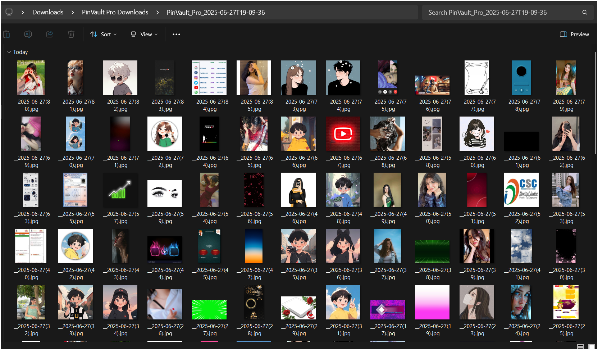
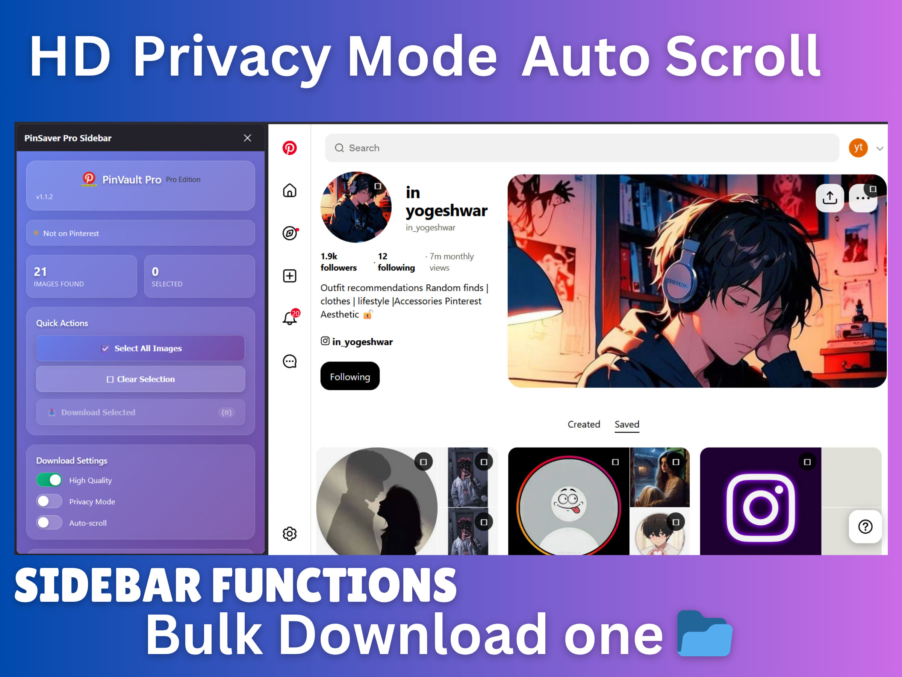
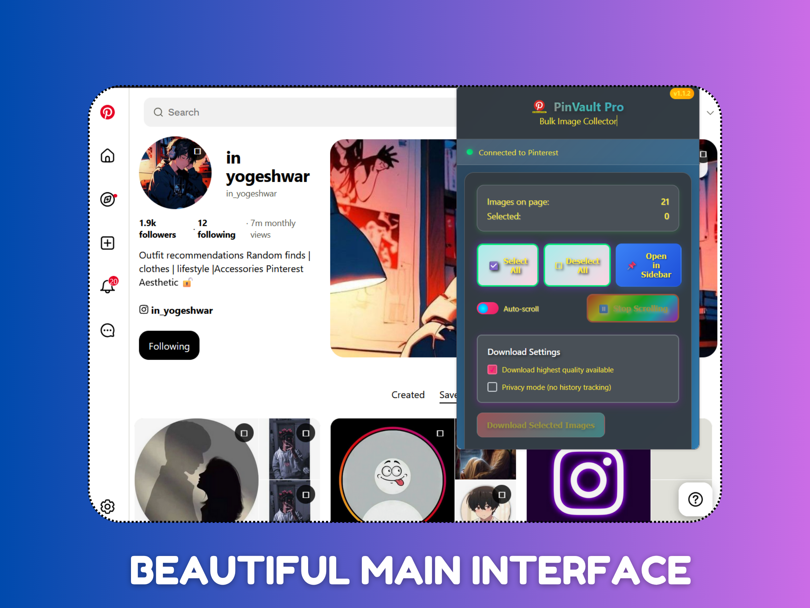

# PinVault Pro - Professional Pinterest Image Downloader

<div align="center">


[](https://addons.mozilla.org)
[](https://microsoftedge.microsoft.com/addons)
[](https://chrome.google.com/webstore)
[](https://addons.opera.com)

[](https://github.com/inyogeshwar/pinvault-pro-extension/releases/latest)
[](https://opensource.org/licenses/MIT)
[](https://github.com/inyogeshwar/pinvault-pro-extension/releases)

**🎯 Professional bulk image downloading tool for Pinterest with AI-powered technology**

[📥 Download](#-installation) • [🔧 Features](#-features) • [📚 Documentation](#-usage) • [🚀 Contribute](#-contributing)

</div>

---

## � Preview Gallery

<div align="center">

### 🖥️ **Complete Extension Overview**


<table>
<tr>
<td align="center" width="33%">

### 📱 **HD Privacy Mode**

*Sidebar with Privacy Controls*

</td>
<td align="center" width="33%">

### 🎨 **Beautiful Interface**  

*Elegant Popup Overlay*

</td>
<td align="center" width="33%">

### 🤖 **AI-Powered Downloads**

*Bulk Selection System*

</td>
</tr>
</table>

</div>

## ✨ Features

<div align="center">

### 🎯 **Core Capabilities**

</div>

<table>
<tr>
<td width="50%">

#### 🖼️ **Smart Image Selection**
- Visual checkbox overlays on Pinterest images
- Bulk selection with real-time counter
- High-quality original resolution downloads
- Intelligent duplicate detection

#### 🤖 **AI-Powered Technology**
- Auto-scroll with smart content detection
- Automatic rate limiting and respect for Pinterest
- AI-driven bulk selection optimization
- Real-time download progress tracking

</td>
<td width="50%">

#### 🎨 **Professional Interface**
- Modern glassmorphism design
- Dual interface: Popup + Sidebar
- Real-time synchronization between interfaces
- Dark/Light theme adaptation

#### 🛡️ **Privacy & Security**
- HD Privacy Mode for secure downloading
- No data collection or external servers
- Local processing only
- Pinterest-exclusive operation

</td>
</tr>
</table>

### 🌍 **Universal Browser Support**

<div align="center">

| Browser | Version | Manifest | Package Size | Status |
|---------|---------|----------|--------------|--------|
| 🦊 **Firefox** | 79.0+ | V2 | 61.4 KB | ✅ Ready |
| 🌐 **Edge** | Chromium | V3 | 60.0 KB | ✅ Ready |
| 🟢 **Chrome** | 88.0+ | V3 | 60.0 KB | ✅ Ready |
| 🔴 **Opera** | 77.0+ | V3 | 60.3 KB | ✅ Ready |

</div>

## 📥 Installation

<div align="center">

### 🚀 **Quick Install Options**

</div>

<details>
<summary><b>🦊 Firefox Installation</b></summary>

<br>

#### **Method 1: Direct Download (Recommended)**
```bash
# Download the XPI file directly
wget https://github.com/inyogeshwar/pinvault-pro-extension/releases/latest/download/PinVault-Pro-Firefox-v1.2.0.xpi
```

#### **Method 2: Manual Installation**
1. 📁 Download `PinVault-Pro-Firefox-v1.2.0.xpi` from [Releases](https://github.com/inyogeshwar/pinvault-pro-extension/releases)
2. 🔧 Open Firefox → `about:addons`
3. ⚙️ Click gear icon → "Install Add-on From File"
4. 📂 Select the downloaded XPI file
5. ✅ Click "Add" to confirm installation

#### **Method 3: Store Installation**
- 🔄 *Coming Soon* - [Mozilla Add-ons Store](https://addons.mozilla.org)

</details>

<details>
<summary><b>🌐 Edge/Chrome Installation</b></summary>

<br>

#### **Method 1: Developer Mode (Current)**
1. 📁 Download `PinVault-Pro-Edge-v1.2.0.zip` from [Releases](https://github.com/inyogeshwar/pinvault-pro-extension/releases)
2. 📂 Extract ZIP file to a permanent folder
3. 🔧 Open `edge://extensions/` or `chrome://extensions/`
4. 🔄 Enable "Developer mode" toggle
5. 📤 Click "Load unpacked"
6. 📂 Select the extracted folder
7. ✅ Extension will be installed and active

#### **Method 2: Store Installation**
- 🔄 *Coming Soon* - [Edge Add-ons](https://microsoftedge.microsoft.com/addons) | [Chrome Web Store](https://chrome.google.com/webstore)

</details>

<details>
<summary><b>🔴 Opera Installation</b></summary>

<br>

#### **Method 1: Developer Mode (Current)**
1. 📁 Download `PinVault-Pro-Opera-v1.2.0.zip` from [Releases](https://github.com/inyogeshwar/pinvault-pro-extension/releases)
2. 📂 Extract ZIP file to a permanent folder
3. 🔧 Open `opera://extensions/`
4. 🔄 Enable "Developer mode" 
5. 📤 Click "Load unpacked"
6. 📂 Select the extracted folder
7. ✅ Extension will be installed and active

#### **Method 2: Store Installation**
- 🔄 *Coming Soon* - [Opera Add-ons](https://addons.opera.com)

</details>

<div align="center">

### 📦 **Download Packages**

| Browser | Package | Size | Format |
|---------|---------|------|--------|
| 🦊 Firefox | [`PinVault-Pro-Firefox-v1.2.0.xpi`](https://github.com/inyogeshwar/pinvault-pro-extension/releases/latest/download/PinVault-Pro-Firefox-v1.2.0.xpi) | 61.4 KB | XPI |
| 🌐 Edge/Chrome | [`PinVault-Pro-Edge-v1.2.0.zip`](https://github.com/inyogeshwar/pinvault-pro-extension/releases/latest/download/PinVault-Pro-Edge-v1.2.0.zip) | 60.0 KB | ZIP |
| 🔴 Opera | [`PinVault-Pro-Opera-v1.2.0.zip`](https://github.com/inyogeshwar/pinvault-pro-extension/releases/latest/download/PinVault-Pro-Opera-v1.2.0.zip) | 60.3 KB | ZIP |

</div>

## 🎯 Usage

### Getting Started
1. **📌 Navigate to Pinterest** - Open any Pinterest page or board
2. **🔍 Browse Images** - Images will automatically get selection overlays
3. **✅ Select Images** - Click checkbox overlays to select desired images
4. **⚡ Auto-Scroll** - Use auto-scroll to load more content automatically
5. **📥 Bulk Download** - Use popup or sidebar to download selected images

### Interface Options

#### 🎛️ **Popup Interface** (Primary)
- Click the PinVault Pro icon in your browser toolbar
- Quick access to all controls and image counts
- Perfect for fast operations

#### 📋 **Sidebar Interface** (Desktop Only)
- Extended interface with detailed controls
- Real-time image preview and management
- Ideal for large bulk operations

### 🚀 **Auto-Scroll Feature**
- **Activate:** Click "Start Auto-Scroll" in popup/sidebar
- **Smart Detection:** Automatically detects when to load more content
- **Rate Limiting:** Respects Pinterest's loading patterns
- **Manual Stop:** Click "Stop Auto-Scroll" when finished

## 🏗️ Project Structure

```
pinvault-pro-extension/
├── 📁 firefox-version/          # Firefox Manifest V2
│   ├── manifest.json           # Firefox-specific manifest
│   ├── background.js           # Event page (non-persistent)
│   ├── content.js              # Pinterest page injection
│   ├── popup.html/js/css       # Toolbar popup interface
│   ├── sidebar.html/js/css     # Sidebar interface
│   ├── welcome.html/js         # Welcome/onboarding page
│   ├── styles.css              # Global styles
│   └── icons/                  # Extension icons
│
├── 📁 edge-version/             # Edge/Chrome Manifest V3
│   ├── manifest.json           # Manifest V3 specification
│   ├── background.js           # Service worker
│   ├── content.js              # Pinterest page injection
│   ├── popup.html/js/css       # Action popup interface
│   ├── sidebar.html/js/css     # Side panel interface
│   └── icons/                  # Extension icons
│
├── 📁 opera-version/                # Opera Manifest V3
│   ├── manifest.json           # Opera-specific manifest
│   ├── background.js           # Service worker
│   ├── content.js              # Pinterest page injection
│   ├── popup.html/js/css       # Action popup interface
│   ├── sidebar.html/js/css     # Side panel interface
│   └── icons/                  # Extension icons
│
├── 📦 PinVault-Pro-Firefox-v1.2.0.zip      # Firefox package
├── 📦 PinVault-Pro-Firefox-v1.2.0.xpi      # Firefox XPI
├── 📦 PinVault-Pro-Edge-v1.2.0.zip         # Edge/Chrome package
├── 📦 PinVault-Pro-Opera-v1.2.0.zip        # Opera package
├── 📦 PinVault-Pro-Opera-v1.2.0.nex        # Opera NEX format
├── 📁 screenshots/                          # Preview screenshots
└── 📄 README.md                             # This file
```

## 📥 Releases

All extension packages are available in [GitHub Releases](https://github.com/inyogeshwar/pinvault-pro-extension/releases):

### Latest Release: v1.2.0
- **🦊 Firefox:** [`PinVault-Pro-Firefox-v1.2.0.xpi`](https://github.com/inyogeshwar/pinvault-pro-extension/releases/latest/download/PinVault-Pro-Firefox-v1.2.0.xpi) *(61.4 KB)*
- **🌐 Edge/Chrome:** [`PinVault-Pro-Edge-v1.2.0.zip`](https://github.com/inyogeshwar/pinvault-pro-extension/releases/latest/download/PinVault-Pro-Edge-v1.2.0.zip) *(60.0 KB)*
- **🔴 Opera:** [`PinVault-Pro-Opera-v1.2.0.zip`](https://github.com/inyogeshwar/pinvault-pro-extension/releases/latest/download/PinVault-Pro-Opera-v1.2.0.zip) *(60.3 KB)*

### Installation from Releases
1. **Visit:** [GitHub Releases Page](https://github.com/inyogeshwar/pinvault-pro-extension/releases)
2. **Download:** The appropriate package for your browser
3. **Install:** Follow platform-specific installation instructions above

## 🔧 Development

### Prerequisites
- **Node.js** (for any build tools, optional)
- **Git** for version control
- **Browser** with developer mode enabled

### Setup
```bash
# Clone the repository
git clone https://github.com/inyogeshwar/pinvault-pro-extension.git
cd pinvault-pro-extension

# For Firefox development
cd firefox-version

# For Edge/Chrome development  
cd edge-version
```

### Testing
1. **Firefox:**
   - Open `about:debugging`
   - Load temporary add-on from `firefox-version/manifest.json`

2. **Edge/Chrome:**
   - Open Extensions page → Developer mode
   - Load unpacked from `edge-version/` folder

3. **Opera:**
   - Open `opera://extensions/` → Developer mode
   - Load unpacked from `opera-version/` folder

### Building Packages
```bash
# Create Firefox package
python create_pinsaver_package.py

# Create Edge package  
python create_edge_package.py

# Create Opera package
python create_opera_package.py
```

## 🤝 Contributing

We welcome contributions! Please see our [Contributing Guidelines](CONTRIBUTING.md) for details.

### Development Workflow
1. **🍴 Fork** the repository
2. **🌿 Create** a feature branch (`git checkout -b feature/amazing-feature`)
3. **💻 Commit** your changes (`git commit -m 'Add amazing feature'`)
4. **📤 Push** to the branch (`git push origin feature/amazing-feature`)
5. **🔄 Open** a Pull Request

### Code Style
- **JavaScript:** ES6+ with async/await
- **HTML:** Semantic HTML5
- **CSS:** Modern CSS with custom properties
- **Comments:** Clear, descriptive comments for complex logic

## 📋 Permissions Explained

### Firefox Version
- **`downloads`** - Save images to your computer
- **`storage`** - Remember your settings and preferences
- **`contextMenus`** - Right-click menu options
- **`activeTab`** - Access current Pinterest tab
- **`tabs`** - Manage extension tabs
- **`*://*.pinterest.com/*`** - Access Pinterest domains globally

### Edge/Chrome Version
- **`downloads`** - Save images to your computer
- **`storage`** - Remember your settings and preferences
- **`contextMenus`** - Right-click menu options
- **`activeTab`** - Access current Pinterest tab
- **`scripting`** - Inject content scripts (Manifest V3)
- **`sidePanel`** - Modern sidebar interface
- **`windows`** - Window management

### Opera Version
- **`downloads`** - Save images to your computer
- **`storage`** - Remember your settings and preferences
- **`contextMenus`** - Right-click menu options
- **`activeTab`** - Access current Pinterest tab
- **`scripting`** - Inject content scripts (Manifest V3)
- **`sidePanel`** - Modern sidebar interface
- **`windows`** - Window management

## 🛡️ Privacy & Security

- **🔒 No Data Collection** - We don't collect or store any personal data
- **💻 Local Processing** - All image processing happens on your device
- **🚫 No External Servers** - No data is sent to external servers
- **🎯 Pinterest Only** - Extension only works on Pinterest domains
- **📝 Open Source** - Full source code available for inspection

## 📄 License

This project is licensed under the MIT License - see the [LICENSE](LICENSE) file for details.

## 🐛 Bug Reports & Feature Requests

Found a bug or have a feature request? Please create an issue:

1. **🐛 Bug Reports:** [Create Bug Report](https://github.com/inyogeshwar/pinvault-pro-extension/issues/new?template=bug_report.md)
2. **✨ Feature Requests:** [Request Feature](https://github.com/inyogeshwar/pinvault-pro-extension/issues/new?template=feature_request.md)

## 📞 Support

- **📧 Email:** [yogeshwar853202@outlook.com](mailto:yogeshwar853202@outlook.com)
- **🐙 GitHub Issues:** [Repository Issues](https://github.com/inyogeshwar/pinvault-pro-extension/issues)
- **📖 Documentation:** [Wiki](https://github.com/inyogeshwar/pinvault-pro-extension/wiki)

## 🎉 Acknowledgments

- **🎨 UI Inspiration** - Modern glassmorphism design trends
- **🔧 Pinterest API** - Built to work seamlessly with Pinterest's interface
- **🌐 Browser APIs** - Leveraging modern extension APIs for optimal performance
- **👥 Community** - Thanks to all contributors and testers

## 📊 Changelog

### v1.2.0 (2025-06-28)
- **🎨 Complete Rebranding** - Updated from PinSaver Pro to PinVault Pro
- **💖 Enhanced Support** - Added Patreon, Ko-fi, and GitHub Sponsors integration
- **🌐 Multi-Browser Support** - Added Opera support alongside Firefox, Edge, Chrome
- **📱 Universal Compatibility** - Optimized for all major browsers with proper manifests
- **🛡️ Privacy Focus** - Enhanced HD Privacy Mode and security features
- **✨ UI Improvements** - Modern glassmorphism design with better UX

### v1.1.3 (2025-06-26)
- **🦊 Firefox Support** - Full Firefox desktop and Android compatibility
- **🌐 Edge Support** - Manifest V3 with modern APIs
- **✅ Validation** - Zero errors/warnings on Firefox AMO
- **🎨 UI Updates** - Improved glassmorphism interface
- **📱 Multi-platform** - Unified experience across browsers

---

<div align="center">

## 🌟 **Support PinVault Pro**

<table>
<tr>
<td align="center">

### 💖 **Support Development**
[](https://patreon.com/inyogeshwar)
[](https://ko-fi.com/yogeshwarkumar)
[](https://github.com/sponsors/inyogeshwar)

</td>
<td align="center">

### 📞 **Get Help**
[](mailto:yogeshwar853202@outlook.com)
[](https://github.com/inyogeshwar/pinvault-pro-extension/issues)

</td>
<td align="center">

### 🚀 **Contribute**
[](https://github.com/inyogeshwar/pinvault-pro-extension/fork)
[](https://github.com/inyogeshwar/pinvault-pro-extension)

</td>
<td align="center">

### � **Follow Updates**
[](https://github.com/inyogeshwar/pinvault-pro-extension/releases)
[](https://github.com/inyogeshwar/pinvault-pro-extension/wiki)

</td>
</tr>
</table>

### 🏆 **Made with ❤️ for the Pinterest Community**

**PinVault Pro** - Professional Pinterest bulk downloading with AI technology

[](LICENSE)
[](https://github.com/inyogeshwar/pinvault-pro-extension/releases/latest)

*Transform your Pinterest experience with intelligent bulk downloading*

</div>
